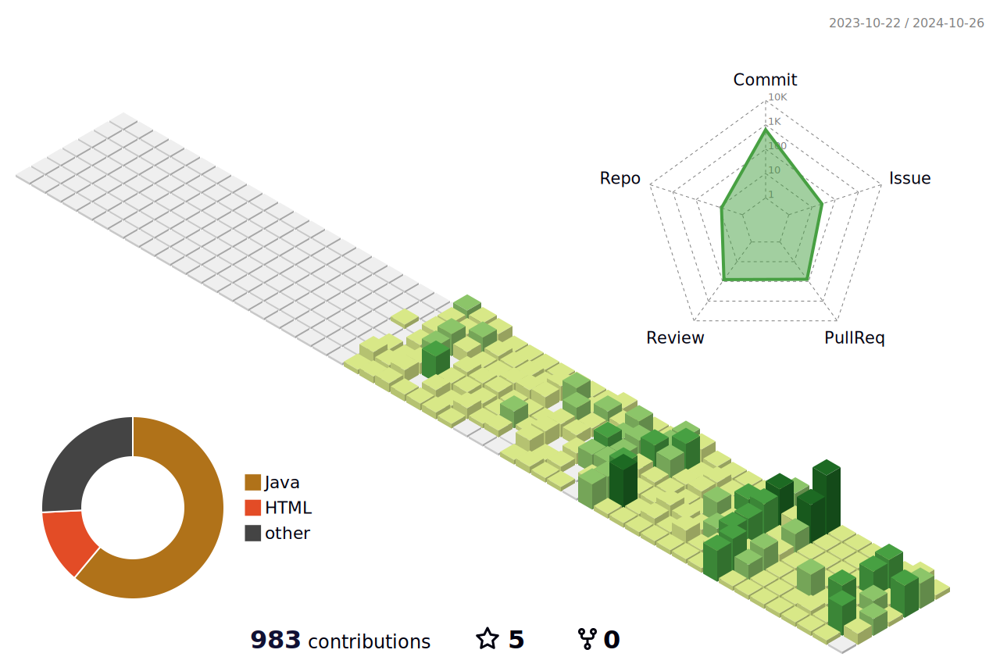

  
  

  &nbsp
  &nbsp
  

## Skills

**Programing Languages**

   
  
  
  

**Frame Work & Library**

 

**Database**

**협업 Tool**

 

## Project

|Project Name|Tech Stack|Team|Period|Link|
|:---:|:---:|:---:|:---:|:---:|
|친환경 리사이클링 쇼핑몰 새롬터| Back : Java, Spring  Front : HTMl, CSS, JS  DB: MySQL |  | 2024/05/27 ~ 2024/07/09| [Repo](https://github.com/Saerom-teo/server)|

## GitStats

<a href="s">
  

    
    
  

</a>
 

  

